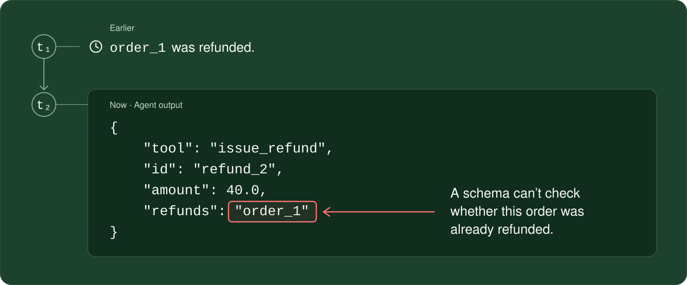
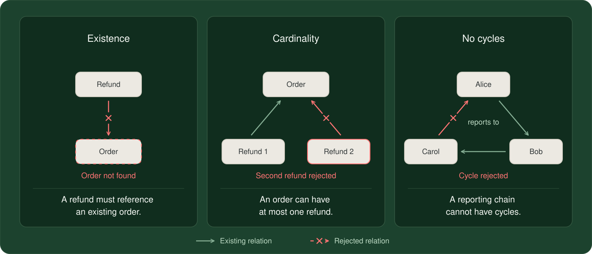
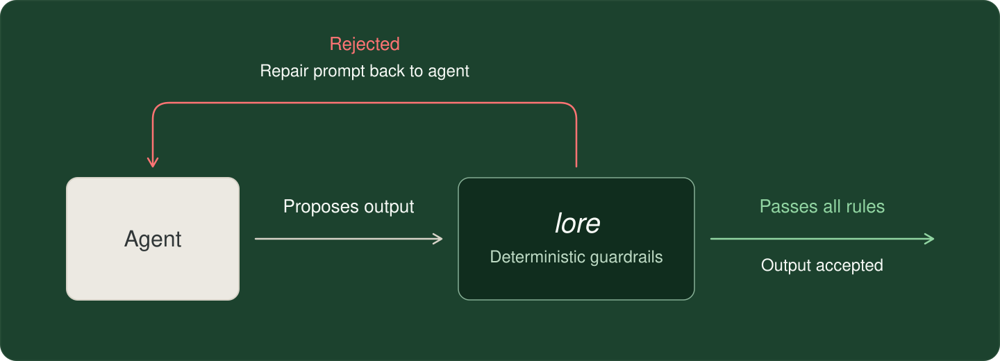
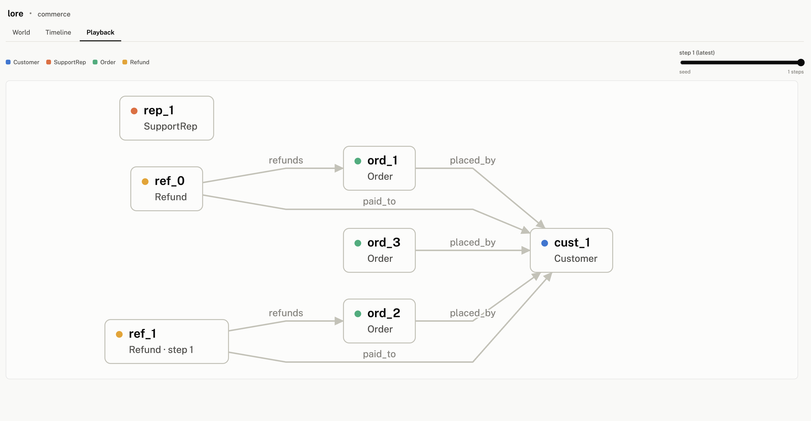

[](LICENSE)
[](pyproject.toml)

Agent outputs are unreliable. Pydantic enforces things like types and schemas, but can't check semantics. `lore` is a library for deterministic guardrails that check the semantics of each agent output against the rules and state of your world.

## Why

Agents often fail by emitting well-formed output that doesn't make sense in relation to the rules of their world and what's already happened in the world. This is because a schema validator like Pydantic checks each agent output in isolation. For example, a customer support agent might issue a refund which correctly matches the refund schema but targets an order that was already refunded before:



`lore` defines the entities in your world and enables you to write declarative rules for the relations between them. It records the state of your world and deterministically checks each agent output against these rules.

Most rules can be expressed with a few common patterns, like these:



`lore` compiles your declarative rules into deterministic guardrails that each agent output must pass through. If an output violates one of the rules, `lore` rejects it and sends a repair prompt back to the agent, explaining which rule failed and which entities were involved.



`lore` was inspired by Frank Coyle's talk on [Why Agentic Systems Need Ontologies](https://www.youtube.com/watch?v=Sir59K8ZDPU).


## Writing your `lore`

`lore` provides simple Python decorators to define the entities in our world and the rules governing them. The code below enforces that each order can have at most one refund (`relation(max_per_target=1)` is used to guarantee this):
```python
from lore import Entity, Lore, Relation, relation

lore = Lore("commerce")

@lore.entity
class Order(Entity):
    total: float

@lore.entity
class Refund(Entity):
    amount: float
    refunds: Relation[Order] = relation(max_per_target=1)
```

We compile our `lore` and try issuing two refunds to the same order, which breaks the rule and sends a repair prompt identifying the order and the violating refunds:

```python
guard = lore.compile()
session = guard.session(seed=[Order(id="order_1", total=100.0)])

first = session.try_commit(
    Refund(id="refund_1", amount=40.0, refunds="order_1")
)
assert first.ok

second = session.try_commit(
    Refund(id="refund_2", amount=40.0, refunds="order_1")
)
assert not second.ok
print(second.repair_prompt())
```

You can view this complete example in [commerce](examples/commerce/world.py).

`lore` can express many other common rules:

| Rule | Declaration |
|---|---|
| A target must exist and have the right type | `Relation[Customer]` |
| A field must use an allowed value | `one_of("paid", "shipped", "refunded")` |
| An entity cannot belong to two incompatible classes | `lore_disjoint_with = [Customer]` |
| A reporting chain cannot contain cycles | `relation(transitive=True, irreflexive=True)` |
| A relation works in both directions | `relation(symmetric=True)` |
| A reverse edge is forbidden | `relation(asymmetric=True)` |
| Custom rule that isn't covered by the categories above | `@lore.rule` |

For those who have worked with description logics, this vocabulary will look familiar!

## Benchmark results

We ran [τ³-bench airline](https://github.com/sierra-research/tau2-bench/tree/main/data/tau2/domains/airline) (50 tasks × 4 trials, text mode) with the published
baseline settings, adding `lore` checks around the agent's six write tools.

| Setup | pass¹ | pass⁴ | Cost per conversation |
|---|---:|---:|---:|
| Stock Sonnet 4.6 (published baseline) | 82.5% | 76.0% | $0.253 |
| Sonnet 4.6 + lore | 89.0% | 82.0% | ~$0.27 |

`lore` blocked six airline policy violations during the run, and the agent recovered and passed in all six cases. One example is a task where we went from 0/4 baseline passes to 4/4, in which airline policy mandates using at most one certificate to pay for a trip but a user requests the agent to use two certificates to pay.

Using a frontier model might address these issues, but we still expect to see cost and latency advantages with `lore`.

Methodology, per-task notes, and limitations live in [benchmarks/tau3_airline/RESULTS.md](benchmarks/tau3_airline/RESULTS.md). This is a single-run comparison.

## Examples

| Example | What it covers |
|---|---|
| [Commerce](examples/commerce/demo.py) | Support agent to manage refunds |
| [HR](examples/hr/demo.py) | Org-chart agent to handle reporting cycles and expense approvals |
| [Accounting](examples/accounting/demo.py) | Bookkeeping agent to balance journal entries and manage books |
| [Legal](examples/legal/demo.py) | Contract-drafting agent whose negotiation playbook is enforced instead of prompted |
| [Airline benchmark](benchmarks/tau3_airline/README.md) | Support agent which enforces airline policy |

Each example's `demo.py` runs without an API key. Live examples require
`ANTHROPIC_API_KEY`.


## How `lore` works

`lore` stores your world as a graph: entities are nodes, relations are edges, and fields are attributes. A session starts from your seed data and grows as the agent acts. Each agent output goes through the same loop:

1. The output is compiled into facts (nodes, edges, attributes)
2. These facts are staged as a **proposal** — an overlay on the graph that doesn't change it
3. Every check runs against the graph plus the overlay, enforcing all the rules in the world
4. If all checks pass, the proposal is committed and its facts join the graph. If any check fails, the overlay is discarded — the graph is untouched — and the violation is rendered as a repair prompt naming the rule that failed and the entities involved

The whole loop is deterministic, so the same output against the same state always gets the same verdict. Sessions can be snapshotted to JSON and restored, so the world survives across turns and processes.


## Using `lore` with your agent

`lore` works with frameworks and model providers you already use — it checks outputs and tool calls wherever your stack produces them, and integrating takes a few lines. We have two adapters today:

- **[Pydantic AI](src/lore/adapters/pydantic_ai.py)** — validates agent outputs; a rejection raises `ModelRetry` with the repair prompt. See the [agent demo](examples/commerce/agent_demo.py).
- **[Anthropic tool use](src/lore/adapters/anthropic.py)** — checks each tool call *before* its side effects run; a rejection returns the repair prompt to the model as a tool error. See the [live example](examples/commerce/live_agent.py).

Want `lore` to work with another framework? Open an issue or a PR — always appreciate any contributions!

## Inspecting runs in the web UI

`lore` has a web UI that renders an agent run. It has three tabs: 

* **World** (your entities and rules)
* **Timeline** (every output, verdict, and repair prompt in order)
* **State** (the graph, with playback over time)

You can start by exporting an example run:

```bash
python examples/commerce/demo.py --html commerce.html
open commerce.html
```



To record your own agent's run, attach a `TraceRecorder` to the session and export it when the run ends:

```python
from lore.viz import TraceRecorder, to_html

recorder = TraceRecorder()
session = guard.session(seed=[...], recorder=recorder)
# ... run your agent ...
to_html(guard, trace=recorder, out="run.html")
```

## License

MIT (see [LICENSE](LICENSE)).
